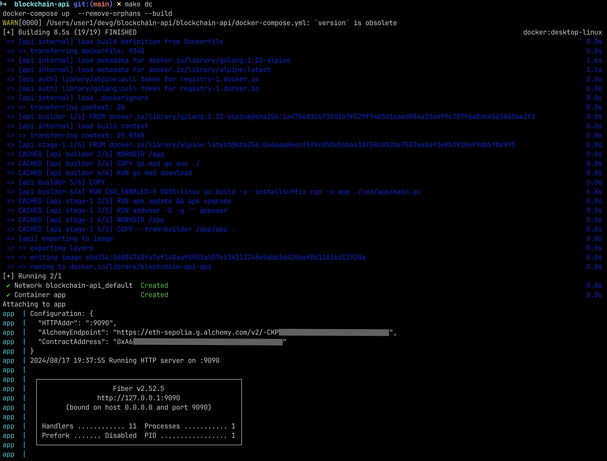

[](https://goreportcard.com/report/github.com/cronnoss/blockchain-api/blockchain-api)


# Back-end developer tech assignment

In this tech assignment your task is to create an API-server for blockchain indexes.

Base item is Group (Solidity smart contract code):

```solidity
struct Group {
    string name;
    uint256[] indexes;
}
```

Group contains a list of ids. Each id represents index:

```solidity
struct Index {
    uint256 id;
    string name;
    uint256 ethPriceInWei;
    uint256 usdPriceInCents;
    uint256 usdCapitalization;
    uint256 percentageChange;
}
```

You should deploy a smart contract on **Sepolia** (ETH test network) and create an API-server that will allow you to
interact with the smart contract.

Contract ABI’s serve as an interface to the smart
contract: [https://github.com/HvrlK/abi-contract](https://github.com/HvrlK/abi-contract)

You contract address should be like: `0xA655555555555555555555555555555555555555`

You should implement next methods:

- GET groups/ (**getGroupIds** method in smart contract)
- GET groups/{groupId} (**getGroup(groupId)** method in smart contract)
- GET indexes/{indexId} (**getIndex(indexId)** method in smart contract)
- GET blocks/{BlockNumber | BlockHash | “latest“} (get block info from **Sepolia**)

Use [fiber](https://github.com/gofiber/fiber) or any other golang framework.
Create [Swagger](https://github.com/go-swagger/go-swagger) documentation.

# 1. Deploy Smart Contract on Sepolia Testnet using Alchemy

See [README.md](index_manager/README.md) in `index_manager` directory.

# 2. Blockchain API

API-server for blockchain indexes

## Solution notes

- :trident: clean architecture (handler->service->repository)
- :book: standard Go project layout (well, more or less :blush:)
- :cd: github CI/CD + docker compose + Makefile included
- :white_check_mark: handler tests with mocks included
- :heart: Swagger auto-generated on `make generate` included

## HOWTO

- :running_man: run app in docker-compose with `make dc`
- :test_tube: run tests with `make test`
- :coin: generate contract from `abi` file with `make abigen`
- :sunflower: run linter with `make lint`

## A picture is worth a thousand words


