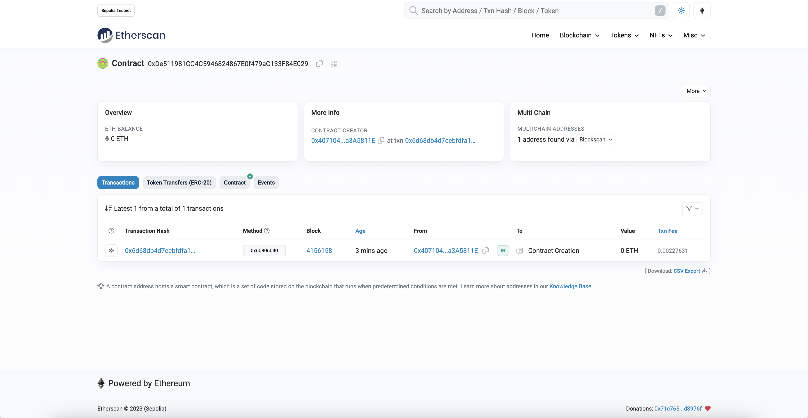

# Deploy Smart Contract on Sepolia Testnet using Alchemy

This is simple project to deploy a smart contract on the sepolia testnet using alchemy.

Inspired by [tutorial Hello World Smart Contract](https://docs.alchemy.com/docs/hello-world-smart-contract).

For deploying your smart contract you have to create your own alchemy account and get the API key.
You can get the API key from [here](https://www.alchemy.com/). 

After getting the API key you have to replace the API key in the `.env` file.

Follow [these instructions](https://support.metamask.io/managing-my-wallet/secret-recovery-phrase-and-private-keys/how-to-export-an-accounts-private-key/) to export your metamask private key.

Metamask private key should be replaced in the `.env` file as well.

To deploy the smart contract on the sepolia testnet you have need some **fake** ETH. To get ETH, you can go to the [sepolia faucet](https://sepoliafaucet.com/) and log into your Alchemy account and enter your wallet address.

## Installation

```bash
npm init # (or npm init --yes)
npm install --save-dev hardhat
npx hardhat
npm install ethers@5.7.2
npm install --save-dev @nomiclabs/hardhat-ethers
npm install -g truffle
truffle init
```
## Build

```bash
npx hardhat compile
```
## Test
```bash
truffle test
```
## Run

```bash
npx hardhat run scripts/deploy.js --network sepolia
```
You should then see something like:
    
```bash
Contract deployed to address: 0xA655555555555555555555555555555555555555
```
**Please copy and paste this address to save it somewhere**, as you will need it to interact with the contract. So, you don't want to lose it.

If we go to the [Sepolia etherscan](https://sepolia.etherscan.io/) and paste the contract address, we should see that it has been deployed successfully. The transactions will look something like this:



Congrats! You just deployed a smart contract to the Ethereum chain 🎉.